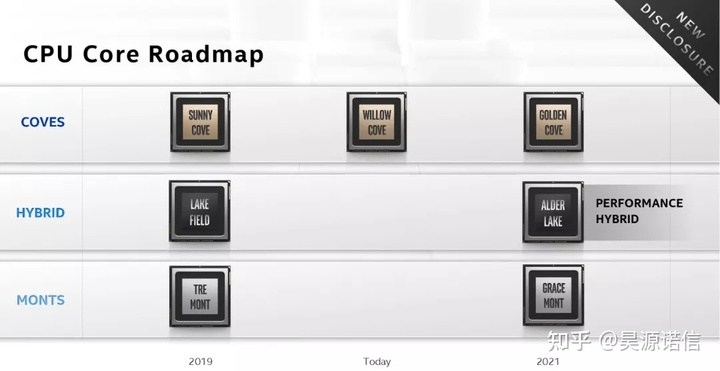

 ---

title: Intel CPU 微架构的演进与发展
date: 2021-11-21 22:10
author: gatieme
tags:
    - linux
    - architecture
    - intel
    - pipeline
categories:
        - 技术积累
thumbnail:
blogexcerpt: Intel CPU 微架构的演进与发展

---

 

本作品采用<a rel="license" href="http://creativecommons.org/licenses/by-nc-sa/4.0/">知识共享署名-非商业性使用-相同方式共享 4.0 国际许可协议</a>进行许可, 转载请注明出处, 谢谢合作

因本人技术水平和知识面有限, 内容如有纰漏或者需要修正的地方, 欢迎大家指正, 鄙人在此谢谢啦

**转载请务必注明出处, 谢谢, 不胜感激**

 

| 日期 | 作者 | GitHub| CSDN | BLOG |
| ------- |:-------:|:-------:|:-------:|:-------:|
| 2021-11-21 | [成坚-gatieme](https://kernel.blog.csdn.net) | [`arch/pipeline/0002-intel`](https://github.com/gatieme/AderXCoding/tree/master/study/arch/pipeline/0002-intel) | [Intel CPU 微架构的演进与发展](https://kernel.blog.csdn.net/article/details/121461546) | [A Journey Through the CPU Pipeline](https://oskernellab.com/2021/02/15/2021/0215-0001-Using_FZF_to_Improve_Productivity)|

 

# 1 处理器微架构发展路线
-------

参见 [CPU 流水线的前世今生](https://kernel.blog.csdn.net/article/details/121461313)

# 2 Tick-Tock 战略
-------

众所周知 Intel 之前有个著名的 [Tick-Tock 战略](https://www.intel.com/content/www/us/en/silicon-innovations/intel-tick-tock-model-general.html)，他指的是每年按照**工艺年-架构年**交替升级产品，持续在前代产品的基础上改进

*   当在工艺年(tick)的时候重点是使用新的制程，小幅修改微架构。

*   当在架构年(tock)的时候，将会推出较大改进的微架构，往往此时 ISA 也会扩展更多指令集，并且优化上年推出的制程，进一步改善功耗和良率，在已经取得成功的产品上持续改进，使得 Intel 始终保持对竞争对手的优势

如果不出意外，产品节奏会是这样。

不过不出意外怎么可能呢。但是计划永远赶不上变化。

到 14nm 的时候，Tick-Tock 策略出现了危机，因为 Tick 工艺节点出现了较大的延迟，内部 14nm 的 Broadwell 推出时出现了一点偏差，外围又有 AMD 的紧追不舍， Intel 不得不出了 Haswell-refresh 来解燃眉之急，不过好在没有太大延迟，随着架构年的 Skylake 微架构的如期发布，也还算是赶上了一年一换代的节奏。

# 3 Processor-Architecture-optimization 策略
-------

不过事情远远没有那么简单。在 Skylake 发布之后，10nm 再一次难产，意识到工艺问题预远没有预期那么简单的牙膏厂，只能被迫将 Tick-Tock 战略彻底放弃。

2016年3月22日，Intel在财务报告中宣布，Tick Tock将放缓至三年一循环，增加优化环节，进一步减缓实际更新的速度。至此改为三步走的 PAO(Processor-Architecture-optimization) 策略，即“制程-架构-优化”。

*   制程：在架构不变的情况下，缩小晶体管体积，以减少功耗及成本

*   架构：在制程不变的情况下，更新处理器架构，以提高性能

*   优化：在制程及架构不变的情况下，对架构进行修复及优化，将BUG减到最低，并提升处理器时钟频率 [1]

于是产品计划变成了这个摸样。

CannonLake 如期作为第一代 10nm 出现，但是 10nm 的问题远比意料中的复杂，CannonLake 产品的发布再次难产，而且随着 AMD 堆核战略在 Ryzen 上取得成效，Intel 决定使用现有产品 14nm 堆核进行应对，这让 Cannonlake 变成了极其尴尬的产品，它将永远成为英特尔推动 10nm 至高无上的努力的障碍。实际仅推出了一款芯片 Core i3-8121U。产品干脆没有上市，实际产品情况变成了这样。

接着就是大家熟知的事情了:

2019年发布基于微架构 Sunny Cove 的 10nm 处理器，也就是之前就被爆出来的 Ice Lake（注意这是处理器代号，而Sunny Cove则是CPU微架构代号），使用的是10nm工艺，提升了 IPC，增加了新的指令集。接下来是 2020 年 发布 Willow Cove，使用 14nm 工艺。

> Willow Cove vs Cypress Cove
>
> Rocket Lake 处理器用的内核 Cypress Cove，它应该是把 10nm 的 Willow Cove 改用14nm工艺生产所用的代号，但它并不完全等于 Willow Cove，应该是结合 14nm 工艺重新开发的。因此 Cypress Cove 相比于 Skylake 的IPC提升可能没 Willow Cove 的 25% 这么多，但是现在14nm工艺所能达到的频率比10nm更高，所以 Rocket Lake 的最高频率会比 Tiger Lake 的 4.7GHz 更高。
>
> [https://www.techpowerup.com/268511/intel-willow-cove-backported-to-14nm-is-cypress-cove](https://www.techpowerup.com/268511/intel-willow-cove-backported-to-14nm-is-cypress-cove)

而 2021 年发布了混合架构的 Alder Lake，同时包含 Golden Cove 微架构的大核和 Grace Mont 微架构的小核，至此以 Cove 架构作为高性能微架构以及 Mont 架构作为其他偏向能耗的处理器的微架构应该是后面几年的主旋律。

# 4 Core 和 Atom
-------

> 本小节内容来源自网络
>
> [Intel CPU的代号/家族/微架构/第几代怎么理解？](https://www.zhihu.com/question/450709783/answer/1794541354?utm_source=wechat_session&utm_medium=social&utm_oi=714537833427136512&utm_content=group3_Answer&utm_campaign=shareopn)

如果不考虑 Larrabee 这个物种的话，Intel 的 x86 产品线可以分为两大品牌系列，也就是 Core 和 Atom，分别对应高性能和低耗电。

总的来说，现在消费级产品里， XXX Lake 就是家族和代号，XXX Cove是大核微架构，XXX Mont是小核微架构。 家族基本一代一变（算上Refresh的话），微架构不一定。

## 4.1 Core
-------

最早的是酷睿 1/2，这个太久远就不说了，Intel 也不把它们当作是第几代酷睿。

第一代酷睿是 Core 三位数字系列，不如 i7 850/920什么的，他们本质都是一个核心，但是每一个系列给了一个奇怪的命名，这个也太远，不多说了。

从第二代酷睿 Sandy  Bridge开始（2000系列），代号、家族、微架构基本是一样的，细分一点看就是不同定位的后缀不一样，但是从理解产品角度看，都是Sandy Bridge就是了。而且每代就只会有一个家族。

此后：第三代 Ivy briddge，第四代Haswell，第五代 Broadwell，第六代Skylake都维持类似的模式，不细究定位他们这些概念和名称都可以混用。

到了第七代 Kaby Lake 开始，因为10nm延期，情况不太一样了，上面概念出现脱离。家族和代号依然基本一致，但是微架构开始和家族/代号脱离关系，一代也不止一个家族/代号了。

首先第七代，Kaby Lake家族，微架构仍然是Skylake。

到了第八代，情况变的复杂了起来。第八代有Coffee Lake家族，Whiskey Lake家族，以及Amber Lake家族，他们彼此定位不同。 而微架构统一为Skylake。另外还有个炮灰Cannon Lake家族，微架构Cannon Lake 后改名Palm Cove。

第九代产品不多，消费级只有一个Coffee Lake Refresh，实际上也还是Coffee Lake，家族/代号的情况不变（或者都加Refresh），也还是Skylake微架构。

第十代产品，是Comet Lake家族，微架构仍然Skylake。低压笔记本还有一个Icelake家族，微架构Sunny Cove。

第十一代产品，MSDT是Rocket Lake家族，微架构Cypress Cove。 笔记本是Tiger Lake家族，微架构Willow Cove。

第十二代产品，只有一个家族Alder Lake，同时包含Golden Cove和Gracemont微架构。

## 4.2 Atom
-------

第一个 Atom 诞生于 2008 年，比 Core 晚了两年。当时正值移动设备迅速崛起，Intel 全副身家都押宝 x86，Atom 则是其中被寄予厚望的品牌之一。

由于缺乏良好的生态以及配套服务，Atom 最终在手机市场败下阵来，不过这个品牌并未消亡，由于 x86 在工业领域具备非常好生态，因此 Atom 都被做成工控机、路由器、NAS 等不需要高性能内核的应用场合。

最初的 Atom 微架构代号是 Bonnell，之后有名为 Saltwell 的衍生微架构，这两代都是属于顺序执行流水线，虽然省电，当时性能真的一般。

第三代 Atom 微架构名为 Silvermont，引入了乱序执行，衍生微架构有为 Airmont。

自此开始，所有的新 Atom 微架构代号都带有 "-mont" 的后缀。

一般把 Sivermont 视作第一代乱序执行 Atom 微架构，之后分别有 Goldenmont（衍生微架构为 Goldenmont Plus）、Tremont 以及 Gracemont。2021 年发布的 Alder Lake 的 E-core 就是 Gracemont 已经是第四代乱序 Atom 微架构。

# 参考资料
-------

| 编号 | 链接 | 描述 |
|:---:|:----:|:---:|
| 1 | [Intel_Tick-Tock](https://zh.wikipedia.org/wiki/Intel_Tick-Tock) | 维基百科-Intel 微架构 |
| 2 | [详述Intel系列CPU架构的发展史](https://wenku.baidu.com/view/e465434b2b160b4e767fcf44.html) | NA |
| 3 | [【X86】---关于Intel芯片架构的发展史](https://www.cnblogs.com/szhb-5251/p/6669860.html) | NA |
| 4 | [英特尔微处理器列表](https://zh.wikipedia.org/wiki/英特尔微处理器列表) | NA |
| 5 | [Intel真的在挤牙膏？历代Core i7处理器性能大比拼](https://www.expreview.com/49967-2.html) | NA |
| 6 | [INTEL CPU全系列架构发展史](http://www.360doc.com/content/20/0218/07/31409419_892835563.shtml) | NA |
| 7 | [Microarchitectures - Intel](https://en.wikichip.org/wiki/intel/microarchitectures) | NA |
| 8 | [List of Intel CPU microarchitectures](https://infogalactic.com/info/List_of_Intel_CPU_microarchitectures) | NA |
| 9 | [List of Intel CPU microarchitectures](https://wikimili.com/en/List_of_Intel_CPU_microarchitectures) | NA |
| 10 | [Intel Microarchitecture Overview](https://www.thomas-krenn.com/en/wiki/Intel_Microarchitecture_Overview) | NA |
| 11 | [英特尔新一代Core微架构全面解析](http://tech.sina.com.cn/h/2006-04-27/1421920715.shtml) | NA |
| 12 | [一起聊聊业界即将用上的Intel Golden Cove高性能核心？](https://zhuanlan.zhihu.com/p/411109256) | NA |
| 13 | [IceLake微架构CPU介绍与性能分析](https://zhuanlan.zhihu.com/p/83399457) | NA |
| 14 | [Microarchitectures - Intel](https://en.wikichip.org/wiki/intel/microarchitectures) | NA |
| 15 | [从 E5-2690v4 的 NUMA 数量说起，浅谈 Broadwell 到 Skylake 的改进](https://www.starduster.me/2018/05/18/talk-about-evolution-from-broadwell-to-skylake) | NA |
| 16 | [从核心性能不一致到sub-numa](https://zhuanlan.zhihu.com/p/60110000) | NA |
| 17 | [NUMA入门：那些必须知道的基础概念](https://www.it610.com/article/1281587993060065280.htm) | NA |
| 18 | [NUMA Domian和NUMA Distance](https://www.cnblogs.com/kongchung/p/14745803.html) | NA |
| 19 | [如何看待第 12 代英特尔酷睿处理器的产品革新？会给行业带来什么影响？](https://www.zhihu.com/question/494592488/answer/2206656842) | NA |

 

*   本作品/博文 ( [AderStep-紫夜阑珊-青伶巷草 Copyright ©2013-2017](http://blog.csdn.net/gatieme) ), 由 [成坚(gatieme)](http://blog.csdn.net/gatieme) 创作.

*   采用<a rel="license" href="http://creativecommons.org/licenses/by-nc-sa/4.0/">知识共享署名-非商业性使用-相同方式共享 4.0 国际许可协议</a>进行许可. 欢迎转载、使用、重新发布, 但务必保留文章署名[成坚gatieme](http://blog.csdn.net/gatieme) ( 包含链接: http://blog.csdn.net/gatieme ), 不得用于商业目的.

*   基于本文修改后的作品务必以相同的许可发布. 如有任何疑问, 请与我联系.

*   **转载请务必注明出处, 谢谢, 不胜感激**
 
