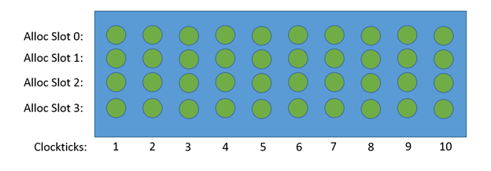

 ---

title: 工具
date: 2021-06-26 09:40
author: gatieme
tags:
    - linux
    - tools
categories:
        - 技术积累
thumbnail:
blogexcerpt: 虚拟化 & KVM 子系统

---

 

本作品采用<a rel="license" href="http://creativecommons.org/licenses/by-nc-sa/4.0/">知识共享署名-非商业性使用-相同方式共享 4.0 国际许可协议</a>进行许可, 转载请注明出处, 谢谢合作

因本人技术水平和知识面有限, 内容如有纰漏或者需要修正的地方, 欢迎大家指正, 鄙人在此谢谢啦

**转载请务必注明出处, 谢谢, 不胜感激**

 

| 日期 | 作者 | GitHub| CSDN | BLOG |
| ------- |:-------:|:-------:|:-------:|:-------:|
| 2021-02-15 | [成坚-gatieme](https://kernel.blog.csdn.net) | [`AderXCoding/system/tools/fzf`](https://github.com/gatieme/AderXCoding/tree/master/system/tools/fzf) | [使用模糊搜索神器 FZF 来提升办公体验](https://blog.csdn.net/gatieme/article/details/113828826) | [Using FZF to Improve Productivit](https://oskernellab.com/2021/02/15/2021/0215-0001-Using_FZF_to_Improve_Productivity)|

 

# 1 Top-Down 概述
-------

自顶向下的微架构分析方法(Top-Down Microarchitecture)

| 类型 | 描述 |
|:---:|:----:|
| Retiring | 正常执行 |
| Bad Speculation | 投机错误 |
| 

# 2 背景知识解析
-------

| 类型 | 描述 |
|:---:|:----:|
| [uOps](https://www.intel.com/content/www/us/en/develop/documentation/vtune-help/top/reference/cpu-metrics-reference/uops.html) | micro-ops/micro-operations/微指令 是一种底层硬件操作, CPU 前端负责获取体系结构指令中表示的程序代码, 并将其解码为一个或多个 uops. |
| [Pipeline Slots](https://www.intel.com/content/www/us/en/develop/documentation/vtune-help/top/reference/cpu-metrics-reference/pipeline-slots.html) | 一个 pipeline slot 表示处理一个 uOp 需要的硬件资源. Top-Down 分析方法假定对于每个 CPU 核, 在每个时钟周期, 有多个可用的 Pipeline Slots. 这些 Pipeline Slots 的数量被称为 Pipeline Width. |

## 2.1 uOps
-------

## 2.2 Pipeline Slots
-------

在下图的示例中, 是用 4-wide(4-way) 的 CPU 将代码执行 10个时钟周期.

在这个示例中, 包含了 40 个 Pipeline Slots(4 * 10) 资源. 如果一个 Pipeline Slot 没有 retire, 则认为有一个 uOp 产生阻塞(Stall).

如下图所示, 有 20 个 slots(红色) 产生阻塞(没有使一个 uOp 达到 Retire). 这表示从该微架构的角度来看, 代码的执行效率只有 50%.

以 Pipeline Slots 为基础资源所观测和统计到的 Top-Down 数据(如 Front-End Bound 和 Back-End Bound 等), 则表示因各种原因(如 Front-End 问题和 Back-End 问题)导致的 Pipeline Slots 阻塞占总体的百分比.

## 2.3 为什么以 Pipeline Slots 为粒度统计
-------

我们统计 top-down 数据是以 Pipeline Slots 为基准的, 而没有采用 cycle(Clockticks) 作为基准. 理论上将我们统计每个周期内阻塞的占比岂不是更有意义 ?

我们同样用一个示例来看下这个疑问 ?

在这里, 每个周期有两个 Pipeline Slots 被阻塞, 也就是 50% 的 Stalls 和 50% 的 Retiring. 如果使用 Clockticks 而言, 却认为是 100% 的 Stalls, 因为每个周期(cycle)都有一些 Pipeline Slots 被占用.

可见, 与以 Pipeline Slots 测量的指标相比, 以 Clockticks 测量的指标不太精确. 但是, 此类指标对于识别代码中的主要性能瓶颈仍然很有用.

# 1 参考资料
-------

| 编号 | 链接 | 描述 |
|:---:|:----:|:---:|
| 1 | [A Journey Through the CPU Pipeline](https://www.gamedev.net/tutorials/_/technical/general-programming/a-journey-through-the-cpu-pipeline-r3115) | 讲述了 CPU 流水线的前世今生(不断演进和完善) |
| 2 | [Top-down Microarchitecture Analysis Method](https://www.intel.com/content/www/us/en/develop/documentation/vtune-cookbook/top/methodologies/top-down-microarchitecture-analysis-method.html) |
| 3 | [A Top-Down method for performance analysis and counters architecture](https://www.researchgate.net/publication/269302126_A_Top-Down_method_for_performance_analysis_and_counters_architecture) | Intel 关于 topdown 分析方法的论文, 以及 [slide](https://pdfs.semanticscholar.org/b5e0/1ab1baa6640a39edfa06d556fabd882cdf64.pdf) |
| 4 |

 

*   本作品/博文 ( [AderStep-紫夜阑珊-青伶巷草 Copyright ©2013-2017](http://blog.csdn.net/gatieme) ), 由 [成坚(gatieme)](http://blog.csdn.net/gatieme) 创作.

*   采用<a rel="license" href="http://creativecommons.org/licenses/by-nc-sa/4.0/">知识共享署名-非商业性使用-相同方式共享 4.0 国际许可协议</a>进行许可. 欢迎转载、使用、重新发布, 但务必保留文章署名[成坚gatieme](http://blog.csdn.net/gatieme) ( 包含链接: http://blog.csdn.net/gatieme ), 不得用于商业目的.

*   基于本文修改后的作品务必以相同的许可发布. 如有任何疑问, 请与我联系.

*   **转载请务必注明出处, 谢谢, 不胜感激**
 
