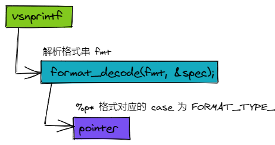
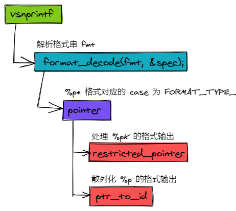

kptr_restrict 向用户空间内核中的指针(/proc/kallsyms-modules显示value全部为0)
=======

| CSDN | GitHub |
|:----:|:------:|
| [kptr_restrict 向用户空间内核中的指针(/proc/kallsyms-modules显示value全部为0)](http://blog.csdn.net/gatieme) | [`LinuxDeviceDrivers/study/debug/filesystem/procfs/kptr_restrict`](https://github.com/gatieme/LDD-LinuxDeviceDrivers/tree/master/study/debug/filesystem/procfs/kptr_restrict) |

<br>

<a rel="license" href="http://creativecommons.org/licenses/by-nc-sa/4.0/"></a>

本作品采用<a rel="license" href="http://creativecommons.org/licenses/by-nc-sa/4.0/">知识共享署名-非商业性使用-相同方式共享 4.0 国际许可协议</a>进行许可, 转载请注明出处, 谢谢合作

因本人技术水平和知识面有限, 内容如有纰漏或者需要修正的地方, 欢迎大家指正, 也欢迎大家提供一些其他好的调试工具以供收录, 鄙人在此谢谢啦

<br>


博文更新日志

| 日期	| 更新 |
|:-----:|:----:|
| 2017/10/22 | 基于 4.13 讲解 kptr_restrict 的设计与实现      |
| 2021/04/11 | 更新了 4.14~5.12 目前 kptr_restrict 的最新设计 |

# 1	/proc/kallsyms显示value全部为0
-------

今天一个同事问我 `cat /proc/kallsyms` 显示 `value` 全部为 `0`. 我在手机端试了一下, 果然如此.

切换到 `root` 用户运行, 依然是 `0`. 感到十分奇怪, 因为内核发生 `crash` 或者打开 `trace` 的时候, 都是调用的 `sprint_ symbol` 来打印的. 为啥内核可以, 用户态 `cat` 就不行呢?

后来发现是系统为了保护这些符号地址泄露, 而用的一种保护手段, 从而使除 `root` 用户外的普通用户不能直接查看符号地址.

# 2	kptr_restrict 介绍
-------

原因在于内核文件 [`kallsyms.c`](http://elixir.free-electrons.com/linux/v4.13.9/source/kernel/kallsyms.c#L583) 中的显示符号地址命令中做了如下限制.

```cpp
seq_printf(m, "%pK %c %s\n", (void *)iter->value, iter->type, iter->name);
```

只需要把其中的 `%pK` 换成 `%p` 就可以让普通用户查看符号地址了. 很多提权漏洞一般会用到此处的修改来获取符号地址

内核提供控制变量 `/proc/sys/kernel/kptr_restrict` 来进行修改. 从内核文档 `Documentation/sysctl/kernel.txt` 中可以看到 `kptr_restrict` 用于控制内核的一些输出打印.

[`Documentation/printk-formats.txt`](http://elixir.free-electrons.com/linux/v4.13.9/source/Documentation/sysctl/kernel.txt#L371) 有更加详细的描述, 除了我们平时遇到的一些打印格式之外, 还有一些比较特殊的格式(我以前没注意到).

```cpp
==============================================================

kptr_restrict:

This toggle indicates whether restrictions are placed on
exposing kernel addresses via /proc and other interfaces.

When kptr_restrict is set to (0), the default, there are no restrictions.

When kptr_restrict is set to (1), kernel pointers printed using the %pK
format specifier will be replaced with 0's unless the user has CAP_SYSLOG
and effective user and group ids are equal to the real ids. This is
because %pK checks are done at read() time rather than open() time, so
if permissions are elevated between the open() and the read() (e.g via
a setuid binary) then %pK will not leak kernel pointers to unprivileged
users. Note, this is a temporary solution only. The correct long-term
solution is to do the permission checks at open() time. Consider removing
world read permissions from files that use %pK, and using dmesg_restrict
to protect against uses of %pK in dmesg(8) if leaking kernel pointer
values to unprivileged users is a concern.

When kptr_restrict is set to (2), kernel pointers printed using
%pK will be replaced with 0's regardless of privileges.
==============================================================
```

| kptr_restrict | 权限描述 |
|:-------------:|:-------:|
| 0 | root和普通用户都可以读取 |
| 1 | root用户有权限读取, 普通用户没有权限 |
| 2 | 内核将符号地址打印为全0, root和普通用户都没有权限 |


`kptr_restrict` 值为 `2` 时, 所有用户都无法读取内核符号地址.


`kptr_restrict` 值为 `1` 时, 普通用户都无法读取内核符号地址, `root` 用户可以查看.


`kptr_restrict` 值为 `0` 时, 所有用户都可以读取内核地址.


>注意 `kptr_restrict` 对内核中很多地址和符号表的信息导出都有影响, 比如 `/proc/modules` 等.

# 3	kptr_restrict的设计
-------


| 时间  | 作者 | 特性 | 描述 | 是否合入主线 | 链接 |
|:----:|:----:|:---:|:----:|:---------:|:----:|
| 2010/12/23 | Dan Rosenberg <drosenberg@vsecurity.com> | [kptr_restrict for hiding kernel pointers from unprivileged users](https://lore.kernel.org/patchwork/cover/229987) | 引入 kptr_restrict 限制都内核指针的读取 | v7 ☑ 2.6.38-rc1| [v7 PatchWork](https://lore.kernel.org/patchwork/cover/228326)<br>*-*-*-*-*-*-*-* <br>[v7 PatchWork](https://lore.kernel.org/patchwork/cover/229987)<br>*-*-*-*-*-*-*-* <br>[commit 455cd5ab305c](https://git.kernel.org/pub/scm/linux/kernel/git/torvalds/linux.git/commit/?id=455cd5ab305c90ffc422dd2e0fb634730942b257)  |
| 2017/11/19 | Tobin C. Harding <me@tobin.cc> | [hash addresses printed with %p](https://lore.kernel.org/patchwork/cover/856356) | 内核中 %p 打印的地址会暴露内核态地址信息, 是极其不安全的, 因此限制 %p 的打印信息, 它将打印一个散列值, 并不是实际的地址. 如果想要打印实际地址, 需要显式指定 %px. | v11 ☑ 4.15-rc2 | [PatchWork](https://lore.kernel.org/patchwork/cover/856356)<br>*-*-*-*-*-*-*-* <br>[关键 commit 57e734423add](https://git.kernel.org/pub/scm/linux/kernel/git/torvalds/linux.git/commit/?id=57e734423adda83f3b05505875343284efe3b39c) |
| 2017/11/29 | Linus Torvalds <torvalds@linux-foundation.org> | vsprintf: don't use 'restricted_pointer()' when not restricting | 如果发现 kptr_restrict 为 0, 则直接跳过 restricted_pointer() 流程. 这个补丁将影响 kptr_restrict 为 0 时, %pK 等同于 %p 输出散列地址.  | v1 4.15-rc2 | [commit ef0010a30935 ("vsprintf: don't use 'restricted_pointer()' when not restricting")](https://git.kernel.org/pub/scm/linux/kernel/git/torvalds/linux.git/commit/?id=ef0010a30935de4e0211cbc7bdffc30446cdee9b) |
| 2018/02/16 | Andy Shevchenko <andriy.shevchenko@linux.intel.com> | [lib/vsprintf: Deduplicate pointer_string()](https://lore.kernel.org/patchwork/patch/888079) | 简单的重构, 删除了一些重复的判断, 逻辑没有任何修正 | [PatchWork](https://lore.kernel.org/patchwork/cover/888079)<br>*-*-*-*-*-*-*-* <br>[关键 commit 496a9a5f3806](https://git.kernel.org/pub/scm/linux/kernel/git/torvalds/linux.git/commit/?id=496a9a5f3806d58b14ae06b390d5b1ffa26e9f9a) |
| 2019/04/17 | Petr Mladek <pmladek@suse.com> | [hvsprintf: Prevent silent crashes and consolidate error handling](https://lore.kernel.org/patchwork/cover/1063203) | 修复上面补丁引入的一个小问题, 限制 restricted_pointer 中 kptr_restrict 为 0 时, 输出散列地址. | v7 ☑ 5.2-rc1 | [PatchWork](https://lore.kernel.org/patchwork/cover/1063193)<br>*-*-*-*-*-*-*-* <br>[关键 commit 1ac2f9789c4b](https://git.kernel.org/pub/scm/linux/kernel/git/torvalds/linux.git/commit/?id=1ac2f9789c4b76ad749870c25ffae0cbcd1f510f) |
| 2020/02/19 | Ilya Dryomov <idryomov@gmail.com> | [vsprintf: don't obfuscate NULL and error pointers](https://lore.kernel.org/patchwork/patch/1196790) | 同样的, 之前 NULL 指针和错误指针的输出也很混乱, 进行了归一化. | v2 ☑ 5.7-rc7 | [PatchWork](https://lore.kernel.org/patchwork/cover/1196790)<br>*-*-*-*-*-*-*-* <br>[关键 commit 7bd57fbc4a4d](https://git.kernel.org/pub/scm/linux/kernel/git/torvalds/linux.git/commit/?id=7bd57fbc4a4ddedc664cad0bbced1b469e24e921) |


## 3.1 v4.14 之前的设计
-------

在 linux 2.6.38 中 [`commit 455cd5ab305c ("kptr_restrict for hiding kernel pointers from unprivileged users")`](https://git.kernel.org/pub/scm/linux/kernel/git/torvalds/linux.git/commit/?id=455cd5ab305c90ffc422dd2e0fb634730942b257) 引入了 `kptr_restrict` 用来限制用户态读取内核指针的显示.



具体处理 kptr_restrict 实现在 pointer 函数中, 该函数用于处理指针格式的 fmt 输出, 源码位于 [`lib/vsprintf.c, v4.13.9, line 1794`](http://elixir.free-electrons.com/linux/v4.13.9/source/lib/vsprintf.c#L1794), 自 2.6.x 到 4.14 之前的版本这段流程没有太大的改动.


```cpp
// https://elixir.bootlin.com/linux/v4.13.9/source/lib/vsprintf.c#L1794
static noinline_for_stack
char *pointer(const char *fmt, char *buf, char *end, void *ptr,
	      struct printf_spec spec)
{
	// ......

	case 'K':
		switch (kptr_restrict) {
		case 0:
			/* Always print %pK values */
			break;
		case 1: {
			const struct cred *cred;

			/*
			 * kptr_restrict==1 cannot be used in IRQ context
			 * because its test for CAP_SYSLOG would be meaningless.
			 */
			if (in_irq() || in_serving_softirq() || in_nmi()) {
				if (spec.field_width == -1)
					spec.field_width = default_width;
				return string(buf, end, "pK-error", spec);
			}

			/*
			 * Only print the real pointer value if the current
			 * process has CAP_SYSLOG and is running with the
			 * same credentials it started with. This is because
			 * access to files is checked at open() time, but %pK
			 * checks permission at read() time. We don't want to
			 * leak pointer values if a binary opens a file using
			 * %pK and then elevates privileges before reading it.
			 */
			cred = current_cred();
			if (!has_capability_noaudit(current, CAP_SYSLOG) ||
			    !uid_eq(cred->euid, cred->uid) ||
			    !gid_eq(cred->egid, cred->gid))
				ptr = NULL;
			break;
		}
		case 2:
		default:
			/* Always print 0's for %pK */
			ptr = NULL;
			break;
		}
		break;
		// ......
}
```

可见, kptr_restrict

*	为 0 时, 未作任何处理, 直接输出, 这样对所有用户都没有限制.

*	为 1 时, 中断上下文则不允许输出, 否则则校验了用户的权限.

*	为 2 时, 将指针直接置 NULL, 这样所有用户都只能看到全 0.

整体思路还是比较清晰的. 想要详细了解实现全貌的, 可以直接查阅该特性合入时的 patchwork 或者 commit.

| 时间  | 作者 | 特性 | 描述 | 是否合入主线 | 链接 |
|:----:|:----:|:---:|:----:|:---------:|:----:|
| 2010/12/23 | Dan Rosenberg <drosenberg@vsecurity.com> | [kptr_restrict for hiding kernel pointers from unprivileged users](https://lore.kernel.org/patchwork/cover/229987) | 引入 kptr_restrict 限制都内核指针的读取 | v7 ☑ 2.6.38-rc1| [v7 PatchWork](https://lore.kernel.org/patchwork/cover/228326)<br>*-*-*-*-*-*-*-* <br>[v7 PatchWork](https://lore.kernel.org/patchwork/cover/229987)<br>*-*-*-*-*-*-*-* <br>[commit 455cd5ab305c](https://git.kernel.org/pub/scm/linux/kernel/git/torvalds/linux.git/commit/?id=455cd5ab305c90ffc422dd2e0fb634730942b257) |


## 3.2 v4.15 开始的设计
-------

### 3.2.1 printk 地址散列化
-------


在 linux 4.15 中 [commit 57e734423add ("vsprintf: refactor %pK code out of pointer()")](https://git.kernel.org/pub/scm/linux/kernel/git/torvalds/linux.git/commit/?id=57e734423adda83f3b05505875343284efe3b39c) 将 point 中对 `%pK`(kptr_restrict) 的处理都封装到了 restricted_pointer 函数中. 这个修改比较简单, 就不详细描述了. 想要详细了解的同学可以查看提交的 commit

这次修改所属的 patchset 最主要是为了限制 %p 直接暴露内核的地址. 在早期内核中, 我们可以通过 System.map 或者 vmlinux 获取内核符号的地址信息, 内核中也较多的使用 %p 输出一些调试信息, 帮助用户显示一些符号的地址. 但是随着内核不断的演进, 开发者们发现, 随意暴露内核的地址是十分不安全的.

内核实现了越老越多的安全特性, 比如[内核地址随机化](https://lore.kernel.org/patchwork/cover/639469)等等. 正常情况下, kernel image 会按照 vmlinux 链接脚本中的链接地址去映射虚拟地址, 如果开启kaslr, 则会重新再映射一次, 映射到 链接地址 + offset的新地址上去. 如果 offset 每次开机都由 bootloader 随机生成, 那么每次开机后, kernel image最后映射的虚拟地址都不一样, 这就是内核地址随机化.

通过反汇编 vmlinux 以及读取 System.map 得不到内核中函数或者汇编语句的真正地址, 因为攻击者并不知道 kaslr 的 offset. 但是 %p 暴露内核地址将打破了这个限定. 攻击者通过 %p 打印中获取到的地址和 vmlinux 中该符号的地址进行比较, 就可以直接获取到 offset 偏移, 进而整个地址随机化机制将形同虚设.

最直接的办法就是将 %p 的打印全部处理掉.

1.	没必要的从内核中删除掉

2.	有必要但是可以限制的限制下(比如替换成 %pK).

3.	特殊流程下, 要绕过限制直接打印实际地址的, 不做修改(比如 crash 流程输出 PANIC 日志的时候, 有必要输出实际地址.).

但是这些打印太多了, 改起来太麻烦了. 因此社区讨论后, 提出了一种新的方案.

1.	限制 %p 的输出, 不再输出实际的地址, 而是输出一个散列化的地址.

2.	想要在 crash 等流程输出实际地址时, 则使用 %px 输出内核符号的实际地址.

这样不用繁多的删动 %p 打印, 只需要限制 %p 的输出即可. 对于那些有必要输出实际地址的流程, 将 %p 替换为 %px, 这种路径通常是极少的, 改动起来也很少.

### 3.2.2 对 %pK 输出的影响
-------

那么在 %p 的输出被散列的情况下, 对 %pK 输出的影响是什么呢?
首先我们看下实现



```cpp
// https://elixir.bootlin.com/linux/v5.1/source/lib/vsprintf.c#L1481
static noinline_for_stack
char *restricted_pointer(char *buf, char *end, const void *ptr,
			 struct printf_spec spec)
{
	switch (kptr_restrict) {
	case 0:
		/* Always print %pK values */
		break;
	case 1: {
		const struct cred *cred;

		/*
		 * kptr_restrict==1 cannot be used in IRQ context
		 * because its test for CAP_SYSLOG would be meaningless.
		 */
		if (in_irq() || in_serving_softirq() || in_nmi()) {
			if (spec.field_width == -1)
				spec.field_width = 2 * sizeof(ptr);
			return string(buf, end, "pK-error", spec);
		}

		/*
		 * Only print the real pointer value if the current
		 * process has CAP_SYSLOG and is running with the
		 * same credentials it started with. This is because
		 * access to files is checked at open() time, but %pK
		 * checks permission at read() time. We don't want to
		 * leak pointer values if a binary opens a file using
		 * %pK and then elevates privileges before reading it.
		 */
		cred = current_cred();
		if (!has_capability_noaudit(current, CAP_SYSLOG) ||
		    !uid_eq(cred->euid, cred->uid) ||
		    !gid_eq(cred->egid, cred->gid))
			ptr = NULL;
		break;
	}
	case 2:
	default:
		/* Always print 0's for %pK */
		ptr = NULL;
		break;
	}

	return pointer_string(buf, end, ptr, spec);
}
```

| kptr_restrict | 实现 | 输出 |
|:-------------:|:---:|:----:|
| 0 | 不做任何处理, 直接 pointer_string 输出 | 不限制, 所有用户都可以看到实际地址 |
| 1 | 如果有权限(root 用户等), 直接 pointer_string 输出, 否则置 NULL | 部分限制, 普通用户看到全 0, root 等用户看到实际地址 |
| 2 | 直接置 NULL | 全限制, 任何用户都看到全 0 |

想要详细了解具体实现的, 可以直接查阅该特性合入时的 [patchwork ("hash addresses printed with %p")](https://lore.kernel.org/patchwork/cover/856356) 或者 [commit 57e734423add  ("vsprintf: refactor %pK code out of pointer()")](https://git.kernel.org/pub/scm/linux/kernel/git/torvalds/linux.git/commit/?id=57e734423adda83f3b05505875343284efe3b39c).
, 可以直接查看 [`restricted_pointer 函数, v5.1, Line 1481`](https://elixir.bootlin.com/linux/v5.1/source/lib/vsprintf.c#L1481).

上面的提交是最早一版本实现, 后来 Linus 提交了 [commit ef0010a30935 ("vsprintf: don't use 'restricted_pointer()' when not restricting")](https://git.kernel.org/pub/scm/linux/kernel/git/torvalds/linux.git/commit/?id=ef0010a30935de4e0211cbc7bdffc30446cdee9b).

```cpp
static noinline_for_stack
char *pointer(const char *fmt, char *buf, char *end, void *ptr,
	      struct printf_spec spec)
{
	// ......
	case 'K':
		if (!kptr_restrict)
			break;
		return restricted_pointer(buf, end, ptr, spec);
	// ......

	/* default is to _not_ leak addresses, hash before printing */
	return ptr_to_id(buf, end, ptr, spec);
}
```

这个提交在发现如果 kptr_restrict 为 0 的时候, 就不再走 restricted_pointer() 流程, 而是走标准的 %p 格式处理流程, 这个会打印散列的地址. 这本身是合理的, 但是 kptr_restrict 的影响发生了变化. 当然只是 kptr_restrict == 0 时, 等同于 %p, 输出的是散列地址.


| kptr_restrict | 实现 | 输出 |
|:-------------:|:---:|:----:|
| 0 | 不做任何处理, 直接跳过 restricted_pointer() 流程, 使用  ptr_to_id() 输出散列地址 | 限制, 所有用户都可以看到散列地址, 相当于 %p 输出. |
| 1 | 如果有权限(root 用户等), 直接 pointer_string() 输出, 否则置 NULL | 部分限制, 普通用户看到全 0, root 等用户看到实际地址 |
| 2 | 直接置 NULL | 全限制, 任何用户都看到全 0 |

但是大家发现没发现, 上面的补丁其实有个问题, 存在一个空隙. 如果在处理 %pK 输出

1.	在走到 pointer 的时候, 判断 kptr_restrict 不为 0, 走到 restricted_pointer() 流程.

2.	restricted_pointer() 流程中, 如果会继续检查 kptr_restrict 的值, 去做不同的处理.

这里就有间隙了. 前后两次判断 kptr_restrict 的过程中, 并没有加锁, 因此如果前后读取的过程中 kptr_restrict 的值被修改了, 那么行为会变的很奇怪. 因为在 restricted_pointer 流程中, 如果发现 kptr_restrict 为 0, 则是直接用 pointer_string() 输出了实际地址的. 而如果在 restricted_pointer 函数外面, 则等同于 %p, 输出的散列地址. 可见不同时机 %pK 的输出在 kptr_restrict == 0 的时候表现竟然不一样.

这有两种处理办法, 一种是加锁, 让这段流程成为临界区, 互斥执行. 但是这显然没必要. 另外一种方法最简单, 不保证互斥, 只是在 restricted_pointer 流程中如果发现用户期望不限制(kptr_restrict == 0), 则同样打印散列地址.

| 时间  | 作者 | 特性 | 描述 | 是否合入主线 | 链接 |
|:----:|:----:|:---:|:----:|:---------:|:----:|
| 2017/11/19 | Tobin C. Harding <me@tobin.cc> | [hash addresses printed with %p](https://lore.kernel.org/patchwork/cover/856356) | 内核中 %p 打印的地址会暴露内核态地址信息, 是极其不安全的, 因此限制 %p 的打印信息, 它将打印一个散列值, 并不是实际的地址. 如果想要打印实际地址, 需要显式指定 %px. | v11 ☑ 4.15-rc2 | [PatchWork](https://lore.kernel.org/patchwork/cover/856356)<br>*-*-*-*-*-*-*-* <br>[关键 commit 57e734423add](https://git.kernel.org/pub/scm/linux/kernel/git/torvalds/linux.git/commit/?id=57e734423adda83f3b05505875343284efe3b39c) |
| 2017/11/29 | Linus Torvalds <torvalds@linux-foundation.org> | vsprintf: don't use 'restricted_pointer()' when not restricting | 如果发现 kptr_restrict 为 0, 则直接跳过 restricted_pointer() 流程. 这个补丁将影响 kptr_restrict 为 0 时, %pK 等同于 %p 输出散列地址.  | v1 4.15-rc2 | [commit ef0010a30935 ("vsprintf: don't use 'restricted_pointer()' when not restricting")](https://git.kernel.org/pub/scm/linux/kernel/git/torvalds/linux.git/commit/?id=ef0010a30935de4e0211cbc7bdffc30446cdee9b) |
| 2019/04/17 | Petr Mladek <pmladek@suse.com> | [hvsprintf: Prevent silent crashes and consolidate error handling](https://lore.kernel.org/patchwork/cover/1063203) | 修复上面补丁引入的一个小问题, 限制 restricted_pointer 中 kptr_restrict 为 0 时, 输出散列地址. | v7 ☑ 5.2-rc1 | [PatchWork](https://lore.kernel.org/patchwork/cover/1063193)<br>*-*-*-*-*-*-*-* <br>[关键 commit 1ac2f9789c4b](https://git.kernel.org/pub/scm/linux/kernel/git/torvalds/linux.git/commit/?id=1ac2f9789c4b76ad749870c25ffae0cbcd1f510f) |


### 3.2.3 示例
-------

我们制作一个非常简单的用例, 分别用 %p, %pK, %px 打印一下子驱动中指针指向的数组的地址(指针的值)和指针本身的地址.

```cpp
#include <linux/init.h>
#include <linux/module.h>

#include <linux/proc_fs.h>
#include <linux/seq_file.h>

#include <linux/percpu.h>
#include <linux/sched.h>
#include <linux/version.h>


#define SIZE 10
int array[SIZE];

int *p_arr = array;
static int __init exam_seq_init(void)
{
	pr_info("%%p = %p, %%pK = %pK, %%px = %px\n", p_arr, p_arr, p_arr);
	pr_info("%%p = %p, %%pK = %pK, %%px = %px\n", &p_arr, &p_arr, &p_arr);

	return 0;
}

static void __exit exam_seq_exit(void)
{

}

module_init(exam_seq_init);
module_exit(exam_seq_exit);
MODULE_LICENSE("GPL");
```

我们写个脚本, 分别在 kptr_restrict 为 0, 1, 2 时插入模块, 显示下 %p* 的输出.

```cpp
#cat test.sh
#!/bin/bash

dmesg -c


for kptr in `seq 0 2`
do
	echo $kptr > /proc/sys/kernel/kptr_restrict
	KPTR=`cat /proc/sys/kernel/kptr_restrict`
	echo "/proc/sys/kernel/kptr_restrict: $KPTR"
	insmod ./kptr_restrict_test.ko
	dmesg -c
done
```


可以看到输出的内容与我的分析一致.


### 3.2.4 v5.7 的修正
-------

| 时间  | 作者 | 特性 | 描述 | 是否合入主线 | 链接 |
|:----:|:----:|:---:|:----:|:---------:|:----:|
| 2020/02/19 | Ilya Dryomov <idryomov@gmail.com> | [vsprintf: don't obfuscate NULL and error pointers](https://lore.kernel.org/patchwork/patch/1196790) | 同样的, 之前 NULL 指针和错误指针的输出也很混乱, 进行了归一化. | v2 ☑ 5.7-rc7 | [PatchWork](https://lore.kernel.org/patchwork/cover/1196790)<br>*-*-*-*-*-*-*-* <br>[关键 commit 7bd57fbc4a4d](https://git.kernel.org/pub/scm/linux/kernel/git/torvalds/linux.git/commit/?id=7bd57fbc4a4ddedc664cad0bbced1b469e24e921) |

进一步处理了 errr-ptr 和 NULL-ptr 的输出, 让在所有情况下, 显示都保持清晰, 一致.

```cpp
                              ptr         error-ptr              NULL
     %p:            0000000001f8cc5b  fffffffffffffff2  0000000000000000
     %pK, kptr = 0: 0000000001f8cc5b  fffffffffffffff2  0000000000000000
     %px:           ffff888048c04020  fffffffffffffff2  0000000000000000
     %pK, kptr = 1: ffff888048c04020  fffffffffffffff2  0000000000000000
     %pK, kptr = 2: 0000000000000000  0000000000000000  0000000000000000

```

# 4	参考
-------

[Introducing Linux Kernel Symbols](https://onebitbug.me/2011/03/04/introducing-linux-kernel-symbols/)

[Is there a way to set kptr_restrict to 0?](https://stackoverflow.com/questions/20390601/is-there-a-way-to-set-kptr-restrict-to-0)

[kptr_restrict for hiding kernel pointers from unprivileged users](https://git.kernel.org/pub/scm/linux/kernel/git/torvalds/linux.git/commit/?id=455cd5ab305c90ffc422dd2e0fb634730942b257)

[Linux kallsyms 机制分析](http://blog.csdn.net/kehyuanyu/article/details/46346321)


<br>

*	本作品/博文 ( [AderStep-紫夜阑珊-青伶巷草 Copyright ©2013-2017](http://blog.csdn.net/gatieme) ), 由 [成坚(gatieme)](http://blog.csdn.net/gatieme) 创作, 

*	采用<a rel="license" href="http://creativecommons.org/licenses/by-nc-sa/4.0/"></a><a rel="license" href="http://creativecommons.org/licenses/by-nc-sa/4.0/">知识共享署名-非商业性使用-相同方式共享 4.0 国际许可协议</a>进行许可. 欢迎转载、使用、重新发布, 但务必保留文章署名[成坚gatieme](http://blog.csdn.net/gatieme) ( 包含链接: http://blog.csdn.net/gatieme ), 不得用于商业目的.

*	基于本文修改后的作品务必以相同的许可发布. 如有任何疑问, 请与我联系.
