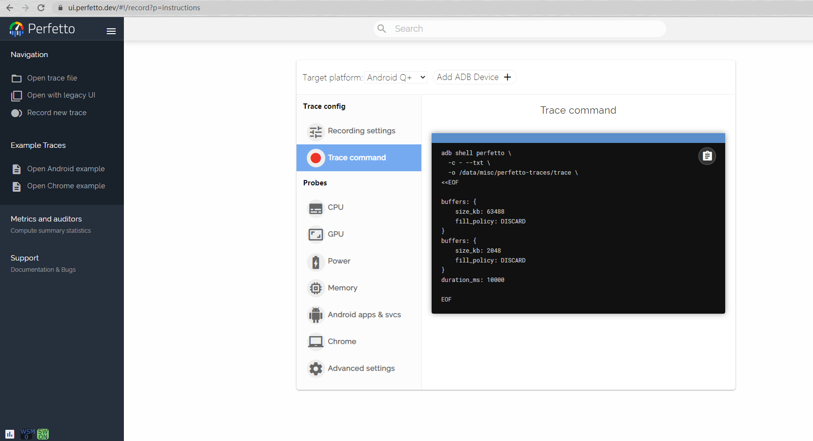

---

title: 使用 Hexo 搭建 GitHub Page 博客(一)
date: 2018-09-02 18:40
author: gatieme
tags: hexo
categories:
        - hexo
thumbnail: 
blogexcerpt: 博文摘要

---

| CSDN | GitHub | Hexo |
|:----:|:------:|:----:|
| [Aderstep--紫夜阑珊-青伶巷草](http://blog.csdn.net/gatieme) | [`AderXCoding/system/tools`](https://github.com/gatieme/AderXCoding/tree/master/system/tools) | [gatieme.github.io](https://gatieme.github.io) |

<br>

<a rel="license" href="http://creativecommons.org/licenses/by-nc-sa/4.0/"></a>

本作品采用<a rel="license" href="http://creativecommons.org/licenses/by-nc-sa/4.0/">知识共享署名-非商业性使用-相同方式共享 4.0 国际许可协议</a>进行许可, 转载请注明出处, 谢谢合作

因本人技术水平和知识面有限, 内容如有纰漏或者需要修正的地方, 欢迎大家指正, 也欢迎大家提供一些其他好的调试工具以供收录, 鄙人在此谢谢啦

<br>

# 1 Perfetto 概述
-------

## 1.1 为什么需要 Perfetto
-------

Perfetto 工具是 Android 下一代全新的统一的 trace 收集和分析框架, 在 Android 9.0(API级别28)或更高版本的设备上, 可以使用 System Tracing 的 System App 在设备上记录系统跟踪
, 可以抓取平台和app的 trace 信息, 是用来取代 systrace 的, 但 systrace 由于历史原因也还会一直存在, 并且 Perfetto 抓取的 trace 文件也可以同样转换成 systrace 视图.

如果习惯用 systrace 的, 可以用 Perfetto UI 的 Open with legacy UI 转换成 systrace 视图来看


## 1.2 Perfetto 优点
-------

1.  支持 Android 和 Linux 上的全系统跟踪, 可以在线抓取长时间(可达数小时)的 trace, 子系统[跟踪处理器](https://perfetto.dev/docs/analysis/trace-processor) 专门设计用于将数小时的跟踪数据有效地保存到本地中, 并基于流行的SQLite查询引擎公开SQL查询接口支持 SQL 查询. 这样就可以在后台开启, 让它一直抓取 trace 了, 特别适用于那种复现概率很低, 又比较严重的性能问题. 


2.  Perfetto 具有很好的可扩展性, 它除了支持标准的 tracepoints(例如CPU调度信息, 内存信息等)之外, 还可以监听系统的多种信息, 比如 procfs 以及 sysfs 接口等; 还可以通过 atrace HAL 层扩展, 在 Android P当中, Google新增加了一个 atrace HAL 层, atrace 进程可以调用这个HAL的接口来获取当前的扩展信息, 比如添加用于记录电池和电量使用的统计信息, 程序的执行路径等. 相关代码可见 [Google 提交](https://android-review.googlesource.com/c/platform/frameworks/native/+/770934), 这样如果需要扩展 tracepoints 的话, 就可以按照 graphic 的示例添加即可.


3.  提供全新的 [Perfetto UI 网站](https://ui.perfetto.dev/), 用于打开的跟踪, 并通过浏览器在本地处理, 不需要任何服务器端交互. 可以在上面通过选取开关的方式, 自动生成抓取 trace 的命令, 同时可以打开 trace 文件. 另外还集成了几种预定义的 trace 分析统计工具, 详情可见它的 Metrics and auditors 选项


> Perfetto 本身是一个框架, 关于它的架构和模块的详细介绍, 可以参考它的 [doc 网站](https://perfetto.dev/docs/), 它的源码可以参考 Android Source Tree 的 /external/perfetto 目录, 里面有很多的tools, 配置和脚本等, 可以拿来直接使用.


# 2 Android 上使用 perfetto
-------


## 2.1 使能 perfetto
-------

由于 `Perfetto` 有一套服务框架, 为了捕获跟踪, 需要运行traced(会话守护程序)和traced_probes(探测和ftrace-interop守护程序).


默认情况下, 这些服务是没有开启的, 可以看下手机上有没有这两个进程运行来确认这点.

```cpp
adb shell "ps -ef | grep -E "traced|traced_probes" | grep -v grep"
```

如果没有这两个服务在运行, 那么可以使用如下命令来启用 perfetto

```cpp
adb shell setprop persist.traced.enable 1
```


## 2.2 抓取 trace
-------

跟 systrace 一样, Perfetto 为我们提供了两种方式来抓取 trace 日志. 

1.  通过 [Perfetto UI](https://ui.perfetto.dev/#!/) 中的记录页面, 参照 [Quickstart: Record traces on Android](https://perfetto.dev/docs/quickstart/android-tracing).

2.  使用 [perfetto命令行](https://perfetto.dev/docs/reference/perfetto-cli) 界面.


我们自然使用 perfetto CLI 命令行方式来抓取.

| 参数使用 | 描述 |
|:------:|:----:|
| --out | 用来指定 trace 输出文件 |
| --config | 用来指定配置, 例如抓多长时间, 间隔多久把内存数据写回文件, 抓取哪些 tracepoints 等等, config 文件内容, 可以自己手动编写, 也可以用 Perfetto UI网站生成 |

```cpp
adb shell perfetto --config :test --out /data/misc/perfetto-traces/trace //使用内置的test配置, 然后输出到/data/misc/perfetto-traces/trace
```

另外在 Perfetto 里面默认集成了一个 test 配置, 可以使用如下命令抓取一个使用 test config 的 trace 文件


# 3 服务器上使用 perfetto
-------


##3.1 编译 perfetto
-------


下载 perfetto 核心代码

```cpp
git clone https://android.googlesource.com/platform/external/perfetto/ && cd perfetto
```


下载并提取构建依赖项：

```cpp
tools/install-build-deps
```

如果脚本因SSL错误而失败, 请尝试以方式调用该脚本 `python3 tools/install-build-deps`, 或升级您的openssl库.

生成所有最常见的GN构建配置：

```cpp
tools/build_all_configs.py
```

构建Linux跟踪二进制文件(在Linux上, 它使用密封的clang工具链, 作为步骤2的一部分下载)：

```cpp
tools/ninja -C out/linux_clang_release traced traced_probes perfetto
```

使用tools/tmux下面的便捷脚本时, 此步骤是可选的.

## 3.2 使用 perfetto
-------

perfetto 是一个命令行工具, 在shell环境下执行, 他依赖于系统中运行的的两个服务进程 traced 和 traced_probes 来完成工作.

Android 通过启用 perfetto 服务来自动运行 traced(会话守护程序)和traced_probes(探测和ftrace-interop守护程序).
但是 Linux 系统中我们必须手动将这两个服务启动起来.

perfetto 为我们提供了 tools/tmux 脚本来完成类似与 Android 上类似的工作, 帮我们启动服务进程, 并设置一个工作面板.


我们可以使用如下命令通过 tools/tmux 脚本来抓取 10S 调度的日志
```cpp
OUT=out/linux_clang_release CONFIG=test/configs/scheduling.cfg tools/tmux -n
```

> perfetto cli 工具运行时候, 需要制定 config 文件, perfetto 默认为我们提供了多个配置模板, 位于仓库路径下 test/configs 目录下.
> 上面我们使用的是默认提供的 scheduling 的配置, 我们也可以自定义 config 或者用 perfeto ui 生成 config.


脚本首先将我们需要的服务程序和 perfetto CLI 工具及其依赖库都拷贝到了 TMP 目录下 `/tmp/perfetto.xxxxxx`.
然后使用 tmux 帮我们打开了一个有三个面板的 TMUX 窗口, 从上往下分别启动了: traced, traced_probes 和 perfetto 抓取日志的工作台.
在最底下的 perfetto 工作面板中, 已经为我们预先填好了抓取 perfetto 的命令, 我们只需要回车就可以抓取 10S 调度日志.


> 我们可以使用 Ctrl-B D 退出这个tmux会话
> 也可以使用 tmux attach -t demo, 来重新连接大这个 tmux 会话.
> 使用关闭它 tmux kill-session -t demo.
> 更过关于 tmux 的操作, 请参照博主的另外一篇博客 [linux下的终端利器----tmux](https://blog.csdn.net/gatieme/article/details/49301037).
> 注意请不要使用 tmux 这篇博客中提供的配置文件, 这篇博客中重新绑定了快捷键, 否则你可能需要重新修改 tmux 脚本或者配置文件.

脚本会将跟踪到的日志信息以二进制的格式存在到的 protobuf 中, 参照 [TracePacket](https://perfetto.dev/docs/reference/trace-packet-proto)


# 4 perfetto 的一些技巧
-------


## 4.1 自定义Config
-------

目前最方便的配置文件生成方式是使用Perfetto UI 网站来帮助生成, 点击 Record new trace 会看到有很多的配置界面
选择想要的 tracepoints 之后 点击 Trace Command, 将命令内容拷贝出来直接在终端就可以执行.




## 4.2 使用 SQL 查询和分析日志
-------

子系统 TraceProcessor 基于 SQLite 为 Perfetto 提供了查询和分析数据的能力.
又作为独立的可执行文件提供: trace_processor.

关于这部分的详细信息可以参照 [Quickstart: SQL-based analysis and trace-based metrics](https://perfetto.dev/docs/quickstart/trace-analysis)


## 4.2 trace 格式转换工具
-------


Perfetto 提供了一个兼容的 UI 来打开 原来的 systrace, 参见 [catapult_trace_viewer](https://ui.perfetto.dev/assets/catapult_trace_viewer.html).
不过毕竟是要替代 systrace 的, 因此使用起来有一丢丢问题, 而且也不能打开太的 systrace 文件.

不过 Perfetto 也提供了一些方法, 让你把你抓到的日志转换成 systrace 格式.

*   提供的 traceconv 工具将 Perfetto 跟踪转换为其他跟踪格式.

*   点击 Perfetto 界面的 Legacy UI, 就会把你的日志转换成 systrace 格式并用 catapult_trace_viewer 打开. 你可以点击 save 把你的 systrace 日志保存下来.


# 5 参考资料
-------


[Perfetto工具使用简介](https://www.jianshu.com/p/ab22238a9ab1)

[(两百五十七) 学习perfetto(二)——生成perfetto trace](https://blog.csdn.net/sinat_20059415/article/details/106307905)

[Perfetto使用](https://blog.csdn.net/zhendong_hu/article/details/103858660)

[android-app-performance-analysis-with-perfetto](https://medium.com/kayvan-kaseb/android-app-performance-analysis-with-perfetto-c8707d879abd)

[perfetto docs](https://perfetto.dev/docs)

[（七) 下篇 Android 性能优化 Perfetto 详细介绍](https://www.jianshu.com/p/143412da0081)

<br>

*	本作品/博文 ( [AderStep-紫夜阑珊-青伶巷草 Copyright ©2013-2017](http://blog.csdn.net/gatieme) ), 由 [成坚(gatieme)](http://blog.csdn.net/gatieme) 创作.

*	采用<a rel="license" href="http://creativecommons.org/licenses/by-nc-sa/4.0/"></a><a rel="license" href="http://creativecommons.org/licenses/by-nc-sa/4.0/">知识共享署名-非商业性使用-相同方式共享 4.0 国际许可协议</a>进行许可. 欢迎转载、使用、重新发布, 但务必保留文章署名[成坚gatieme](http://blog.csdn.net/gatieme) ( 包含链接: http://blog.csdn.net/gatieme ), 不得用于商业目的. 

*	基于本文修改后的作品务必以相同的许可发布. 如有任何疑问, 请与我联系.
