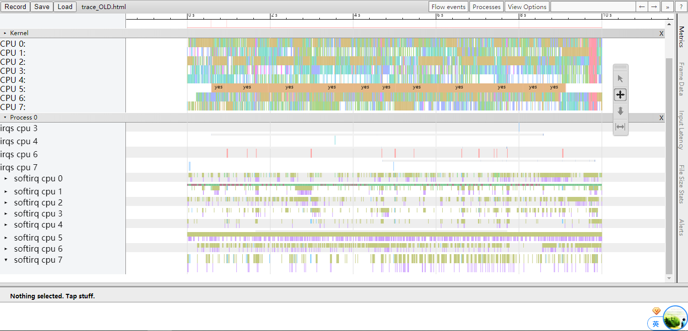
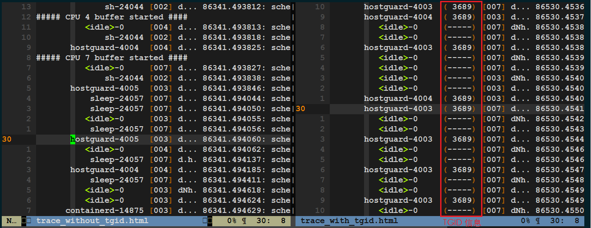
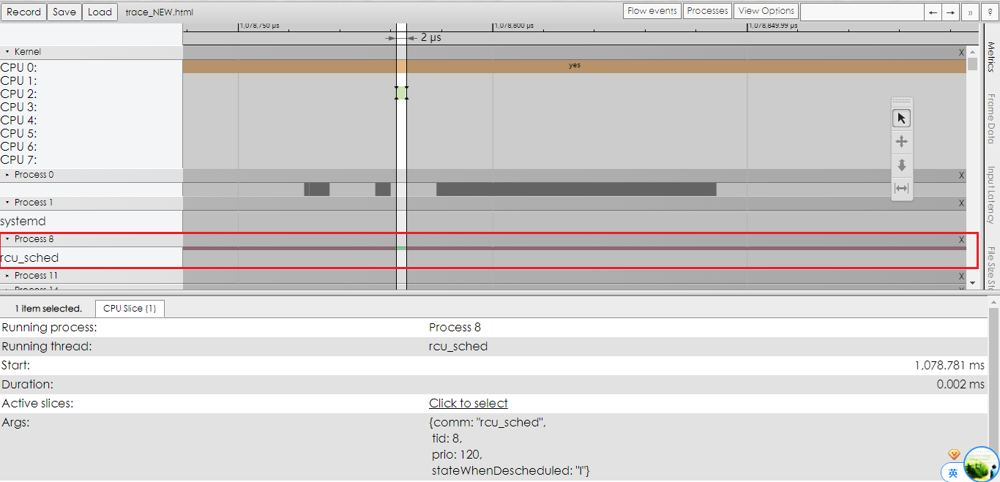

---

title: Systrace for Linux-使用 systrace 分析 linux & android 的调度问题
date: 2020-11-21 20:22
author: gatieme
tags:
	- scheduler
	- linux
	- debug
categories:
	- 内核探秘
thumbnail:
blogexcerpt: <br>笔者在日常内核性能优化的工作中, 主要涉及 终端(Android) 和 服务器(Server) 和 嵌入式 (RTOS) 等多个场景, 在终端场景下做内核开发和调度优化的时候, 经常会使用 atrace、systrace 等工具, 在惊叹于 google 的技术能力, 也时长在想这些工具是否可以用于服务器以及嵌入式领域.<br><br>使用 systrace 可以抓取到 sched、irq 以及帧的信息, 帧的信息我们服务器和嵌入式领域肯定是不会有的, 但是 sched、irq 等信息, 对于服务器领域也同样有意义. 如果能够在这些场景使用 systrace, 对于我们性能调优是有重大意义的.


---


| 日期 | 作者 | CSDN | GitHub | BLOG |
| ------- |:-------:|:-------:|:-------:|:-------:|
| 2020-11-21 | [gatieme](https://blog.csdn.net/gatieme) |  [Systrace for Linux-使用 systrace 分析 linux & android 的调度问题](https://kernel.blog.csdn.net/article/details/110296102) | [`LDD-LinuxDeviceDrivers/study/debug/tools/systrace`](https://github.com/gatieme/LDD-LinuxDeviceDrivers/tree/master/study/debug/tools/systrace) | [OSKernelLAB](https://oskernellab.com/2020/11/21/2020/1121-0001-Systrace_for_linux)|


<br>


本作品采用<a rel="license" href="http://creativecommons.org/licenses/by-nc-sa/4.0/">知识共享署名-非商业性使用-相同方式共享 4.0 国际许可协议</a>进行许可, 转载请注明出处, 谢谢合作

<a rel="license" href="http://creativecommons.org/licenses/by-nc-sa/4.0/"></a>

因本人技术水平和知识面有限, 内容如有纰漏或者需要修正的地方, 欢迎大家指正, 鄙人在此谢谢啦

**转载请务必注明出处, 谢谢, 不胜感激**

<br>

博文更新日志

| 日期 | 更新 |
|:---:|:----:|
| 2021/04/02 | 新增 3.5 节, 使用 record-tgid 显示进程运行信息 |


# 1 问题来源
-------

笔者在日常内核性能优化的工作中, 主要涉及 终端(Android) 和 服务器(Server) 和 嵌入式 (RTOS) 等多个场景, 在终端场景下做内核开发和调度优化的时候, 经常会使用 atrace、systrace 等工具, 在惊叹于 google 的技术能力, 也时长在想这些工具是否可以用于服务器以及嵌入式领域.


使用 systrace 可以抓取到 sched、irq 以及帧的信息, 帧的信息我们服务器和嵌入式领域肯定是不会有的, 但是 sched、irq 等信息, 对于服务器领域也同样有意义. 如果能够在这些场景使用 systrace, 对于我们性能调优是有重大意义的.

systrace 的一些信息如下图所示:

Systrace 报告的屏幕截图


# 2 systrace 简介 & 原理
-------

Android 开发者官网中对 systrace(Android System Trace) 有[专门的文档介绍](https://developer.android.google.cn/studio/command-line/systrace), 或者在进入到官网的首页后，按照 Android Developers > Android Studio > USER GUIDE > Command line tools > systrace的路径访问该文档.

systrace 的原理我们这里不啰嗦了, 可以网上自行搜索:


其主要工作就是使用了 linux kernel 的 ftrace 来完成的
1、systrace调用 atrace 抓取 Android 的 ftrace buffer 数据, atrace 会根据用户指定的参数, 使能 framework 层和 kernel 中对应的 trace events, 同时使能 ftrace.
2、systrace把 trace buffer 的数据和 prefix.html、suffix.html、systrace_trace_viewer.html 合成一个可供 chrome(Trace-Viewer) 直接解析的 `trace.html` 文件；
3、使用chrome浏览器打开 `trace.html` 就可以非常方便的以图形化的形式来查看和分析 `trace` 数据。背后是 [`Trace-Viewer` 的脚本](https://google.github.io/trace-viewer/) 在运行；


systrace 中除了解析 sched、irq 等原生 trace events 的信息, 还需要对帧信息做识别, 因此内核态和用户态的存储trace数据的按照一定格式来输出, 才能被 systrace 解析.

1、对内核 trace 信息不需要任何格式化处理, Trace-Viewer 会对内核原生的 trace format 格式的数据进行解析, 并绘制. 不过只支持几种类型的数据, 比如 sched_switch、sched_wakeup 等可以帮助绘制 CPU 的运行图谱, IRQ 等信息可以用来绘制各个 CPU 中断和软中断的图谱.

2、用户态(app/java framework/native)是通过使用 Trace 类来记录trace信息的, 得益于 ftrace 的 trace marker 机制, 允许用户态向内核的 ftrace buffer 中追加数据, 用户态只需要使用 /sys/kernel/debug/tracing/trace_marker" 接口, 就可以轻松的将格式化的 trace 数据写入到内核的 buffer 中. 因此 Android systrace 约定了一系列的 trace 格式, 这些 Trace 类按照约定的格式 mark 到 ftrace buffer 中, 从而能够被解析并绘制到 Trace-Viewer.


systrace trace event format 请参照 [systrace trace event format](https://docs.google.com/document/d/1CvAClvFfyA5R-PhYUmn5OOQtYMH4h6I0nSsKchNAySU)

# 3 systrace for Linux Desktop/Server
-------

## 3.1 systrce for linux 简介
-------

分析了 systrace 的原理我们就知道, 如果要在服务器上使用 systrace 是可以的. 因为 chrome 支持解析原生内核的 sched、irq 的 trace, 那么我们直接使用这些来分析调度的性能, 基本是满足要求的.
那是否需要追加 trace_view 的头才能解析呢?

这个我最早也是以为是需要的, 但是后来尝试了下, 原生的 trace buffer 扔给 chrome://tracing 就可以解析. 但是如果你想要直接双击或者右键用 chrome 打开就能解析, 是需要追加 HTML 头的.  systrace 追加的 HTML 头中包含了一些标记, 告诉 chrome 这个 html 其实是一个 systrace 文件, 要用 `trace-viewer` 来解析.

那么我们现在我们要做的就只需要把我们需要的 trace event 打开, 然后把待测试完成后, 把 trace buffer dump 出来, 我们可以借助于 google systrace 工具来完成这个事情, 当然也可以选择手动写一些脚本来辅助我们工作.
我从 github 上找到了[这个](https://github.com/ganadist/systrace) (感谢 [YOUNG HO CHA (aka ganachoco)/ganadist](https://github.com/ganadist) 所做的工作, 他是我们的先行者, 没有他这个工作, 我可能会走很多弯路), 并做了一些改进, 我将最终的成品发布在 [systrace for Linux Desktop/Server](https://github.com/gatieme/systrace), 并把他推荐给了同事, 借助这个工具, 为我们在 MYSQL 等场景, 提供了一些调优的输入.

github 地址如下:
```cpp
github https://github.com/gatieme/systrace
```

第一版做的比较简陋, 后期会不断更新和优化的.

## 3.2 systrace.py 使用
-------

systrace.py 脚本比较简单, 是我们提供的用来抓取 trace 的脚本, 它做的事情就是把我们制定的 tracepoint 打开, 然后抓取指定时间的 trace buffer 出来.

比如使用如下命令, 就可以抓取当前开始 1s 内调度和中断的 trace 信息

```cpp
# -t 1 抓取 1s
# -v 表示输出详细信息
# -e "sched,irq" 表示抓取 调度 和 中断 的信息
python systrace.py -t 1 -v -e "sched,irq"
```


在 chrome://tracing 中打开这个抓到的 trace 文件, 如下所示.


## 3.3 fix_time 脚本使用
-------

systrace 能解析并图形化显示的信息有限, 因此在实际开发过程中, 我们经常会手动再开一些 tracepoint, 这些 systrace 没法图形化展示, 但是却能帮助我们分析问题.
一般我们在 systrace 图上找到或者发现了一些问题之后, 再打开 systrace 日志, 找到出问题的时间点, 然后去分析详细的 trace 去探求原因.
但是这里有一些不便的地方, chrome systrace 上显示的时间是是以抓取的时间点为基准( 0MS )的相对时间, 而 trace 日志中的时间是系统的绝对时间.


trace-viewer 上显示的是日志中以抓取开始时间点为基准的相对时间戳


但是 trace 日志文本中显示的是系统的时间(绝对时间)戳


这样我们每次去找出问题的时间点的时候, 都需要再加上抓取时间点的, 然后找到出问题的实际的系统时间点. 这样每次总是很不方便.
因此我们提供了一个 perl 的脚本 fix_time.pl, 用来自动化完成这个工作.


## 3.4 直接使用脚本抓取日志
-------

前面我们提到了, 原始的 trace 日志交给 trace_view 也是可以直接解析的.

> 但是注意
>
> 原始的 trace 文件由于没有 HTML 头标记他是一个 systrace 格式的日志,
> 因此不能保存成 html 文件后, 直接双击通过 chrome 打开
> 必须主动通过 chrome://tracing 来加载才可以.

最简单的抓取 trace 的脚本如下所示


```cpp
#!/bin/bash

TRACING_PATH=/sys/kernel/debug/tracing

get_systrace()
{
        local sleepTime=$1

        rm -rf trace.html
        echo > $TRACING_PATH/trace

        echo 1 > $TRACING_PATH/events/sched/sched_wakeup/enable
        echo 1 > $TRACING_PATH/events/sched/sched_wakeup_new/enable
        echo 1 > $TRACING_PATH/events/sched/sched_switch/enable
        echo 1 > $TRACING_PATH/events/irq/enable

        echo 1 > $TRACING_PATH/tracing_on

        sleep $sleepTime

        echo 0 > $TRACING_PATH/tracing_on
        echo 0 > $TRACING_PATH/events/enable

        cat $TRACING_PATH/trace > trace.html
        echo > $TRACING_PATH/trace
}

get_systrace $1
```

该脚本同样集成到了 [github 仓库](https://github.com/gatieme/systrace/blob/master/scripts/systrace.sh)中, 可以使用如下命令直接抓取 10S 的日志信息.

```cpp
sh ./systrace.sh 10
```

## 3.5 record-tgid 显示进程运行信息
-------

我们之前在 Android 上的 systrace 通常可以看到应用及其所有子线程(进程) 的运行情况.


但是我们在 linux 下抓取的 systrace 中却没有这样的信息. 有些时候不利于我们分析.



通过分析发现, 如果要显示进程的信息, 是需要让 systrace 知道你所在的主进程(tgid)的.

trace-viewer 通过 tgid 讲一个应用下的多个线程放置在一起, 同时用不同颜色标记进程的运行状态.
可以通过 `record-tgid` 接口显示进程的运行信息.

```cpp
echo 1 > /sys/kernel/debug/tracing/options/record-tgid
```

开启了 `record-tgid` 后, trace 文件中进程后面将新增一列 tgid 的信息.



进程运行状态的信息显示出来, 如下所示:




# 4 参考资料
-------

[工利其器】必会工具之（三）systrace篇（1）官网翻译](https://www.cnblogs.com/andy-songwei/p/10659564.html)
[systrace 解析](https://blog.csdn.net/pwl999/article/details/83510943)

[4.1C: Using the Systrace and dumpsys tools](https://google-developer-training.github.io/android-developer-advanced-course-practicals/unit-2-make-your-apps-fast-and-small/lesson-4-performance/4-1c-p-systrace-and-dumpsys/4-1c-p-systrace-and-dumpsys.html)

[Ftrace 实现原理与开发实践](http://tinylab.org/ftrace-principle-and-practice)


<br>

*   本作品/博文 ( [AderStep-紫夜阑珊-青伶巷草 Copyright ©2013-2017](http://blog.csdn.net/gatieme) ), 由 [成坚(gatieme)](http://blog.csdn.net/gatieme) 创作.

*   采用<a rel="license" href="http://creativecommons.org/licenses/by-nc-sa/4.0/"></a><a rel="license" href="http://creativecommons.org/licenses/by-nc-sa/4.0/">知识共享署名-非商业性使用-相同方式共享 4.0 国际许可协议</a>进行许可. 欢迎转载、使用、重新发布, 但务必保留文章署名[成坚gatieme](http://blog.csdn.net/gatieme) ( 包含链接: http://blog.csdn.net/gatieme ), 不得用于商业目的.

*   基于本文修改后的作品务必以相同的许可发布. 如有任何疑问，请与我联系.

*   **转载请务必注明出处, 谢谢, 不胜感激**
<br>
